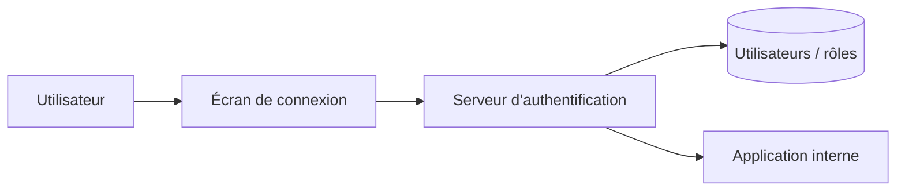

# Flux d’authentification cible

```mermaid
flowchart LR
    User[Utilisateur]
    Login[Écran de connexion]
    Auth[Serveur d’authentification]
    DB[(Utilisateurs / rôles)]
    App[Application interne]

    User --> Login
    Login --> Auth
    Auth --> DB
    Auth --> App
```

## Remarque

Ce flux est une proposition architecturale cible. Il ne documente pas une implémentation existante.
